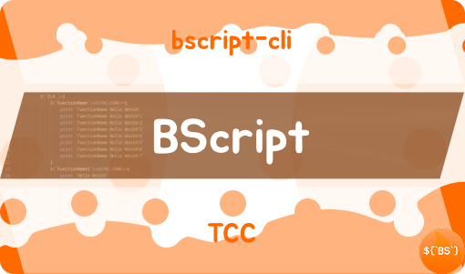
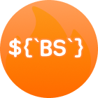

## BScript Runner 

**Lightweight Embeddable Scripting Language for Node.js**

BScript is a compact and flexible scripting engine that allows you to execute custom scripts inside JavaScript applications. It supports variables, conditionals, functions (including async), commands, and nested scopes.

<a href="https://nodejs.org/">

</a>

<a href="https://www.npmjs.com/package/@beiser/bscript-runner">

</a>

<a href="./LICENSE">

</a>

---

## ✨ Key Features

- ✅ Clean and intuitive script syntax
- ✅ Variable assignments and references
- ✅ Conditional logic (`IF` / `ELSE IF` / `ELSE`)
- ✅ Functions (synchronous and asynchronous)
- ✅ Extensible command system
- ✅ Nested scopes and references
- ✅ Strong runtime type system (`Type`)

---

## 📌 Useful Links

| Link | Description |
|------|-------------|
| **[API Reference](./REFERENCE.md)** | Complete public API documentation |
| **[Syntax Reference](./BScript/SYNTAX.md)** — BScript Syntax Reference |
| **[CLI Reference](https://github.com/BEISER901/bscript-cli/blob/main/Docs/BScript/BSCRIPT-REFERENCE-CLI.md)** | Available BScript commands and their declaration. |
| **[bscript-cli](https://github.com/BEISER901/bscript-cli/tree/main)** | Available BScript commands and their declaration. |
| **[API Reference](./REFERENCE.md)** | Complete public API documentation |
| **[Technical](./TECHNICAL.md)** | Internal architecture and implementation details |

---

## 🚀 Quick Start

### Installation

**Using npm**
```bash
npm install @beiser/bscript-runner
```

**Using pnpm**
```bash
pnpm add @beiser/bscript-runner
```

**Using yarn**
```bash
yarn add @beiser/bscript-runner
```

---

### Basic Usage

```javascript
const BScript = require("@beiser/bscript-runner").BScript
const Runner = require("bscript-runner").Runner

const script = `
$(\`test\`)=\`Hello world!\`
print \${$test}
`;

const cli = new BScript();
cli.cmdRootPermissions = [cli.perrmissionsKeys.default, cli.perrmissionsKeys.script]
cli.updateCommands()

const bScriptRunner = new Runner(cli)
bScriptRunner.Create(script)
bScriptRunner.executer(); // Hello world!
```

---

### Getting Started

1. Install the `bscript-runner` package
2. Create a new `Runner` instance
3. Prepare your script text and call `Create()`
4. Execute the returned `executer()`

---

## 📚 Documentation

- **[Syntax](./BScript/SYNTAX.md)** — BScript Syntax Reference
- **[API Reference](./REFERENCE.md)** — Full public API documentation
- **[Technical](./TECHNICAL.md)** — Architecture and internal implementation

---

## 🛠 Core Modules

- **Runner** — Main class for compiling and executing scripts
- **Type** — Type system for all BScript values
- **Helpers** — Utilities for creating typed values and working with the runtime

---

## 📦 Requirements

- Node.js **18+**
- npm / pnpm / yarn

---

## 🤝 Contributing

Contributions are welcome!

Please read **[TECHNICAL.md](./TECHNICAL.md)** before submitting a Pull Request.

---

## 📄 License

This project is licensed under the **MIT License**.

See the **[LICENSE](./LICENSE)** file for details.

---

**Made with ❤️ for the Node.js ecosystem**